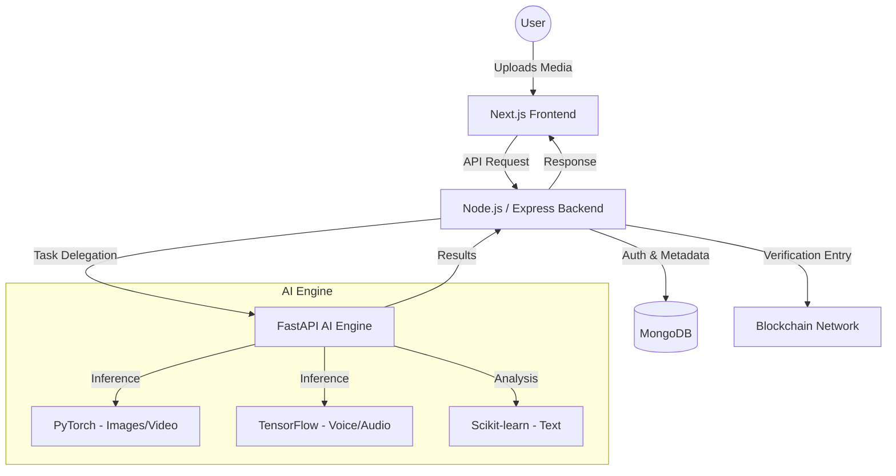

# 🛡️ DeepFake Detection Platform: The Vanguard of Digital Integrity

[](https://nextjs.org/)
[](https://nodejs.org/)
[](https://fastapi.tiangolo.com/)
[](https://pytorch.org/)
[](https://www.tensorflow.org/)

> **"Empowering Authenticity in a Digital World."**

The DeepFake Detection Platform is a cutting-edge, enterprise-grade solution designed to combat the rising tide of synthetic media. By leveraging state-of-the-art Deep Learning models and a robust, multi-layered architecture, we provide real-time verification for images, videos, audio, and text, ensuring that truth remains the standard in your digital environment.

---

## 🌟 Key Features

### 🔍 Multimodal AI Detection
- **Image Analysis**: Pixel-level artifact detection using CNN/Transformer models.
- **Video Verification**: Temporal consistency analysis and frame-by-frame deepfake scanning.
- **Audio Authentication**: Voice spoofing and synthetic clone detection using MFCC neural harmonics.
- **Text Integrity**: AI-generated content and spam detection for messages and documents.

### ⛓️ Provenance & Transparency
- **Blockchain Anchoring**: Every verification is immutably recorded (Ethereum/Polygon/Hyperledger) for forensic auditability.
- **Detailed Forensic Reports**: Professional, court-ready reports with explainable AI insights.
- **Provenance Timeline**: Track the lifecycle and evolution of media assets with clear lineage.

### 🛡️ Enterprise Management
- **Role-Based Access Control (RBAC)**: Secure access for Admins, Moderators, and General Users.
- **Admin Dashboard**: Real-time system monitoring, API health, and model governance.
- **Moderator Panel**: Human-in-the-loop verification and report auditing.

---

## 🏗️ Architecture Overview



---

## 💻 Technology Stack

### Frontend
- **Framework**: [Next.js 15+](https://nextjs.org/) (App Router)
- **State Management**: [Zustand](https://zustand-demo.pmnd.rs/)
- **Data Fetching**: [TanStack Query v5](https://tanstack.com/query/latest)
- **UI Components**: [Ant Design 6](https://ant.design/) & [Framer Motion](https://www.framer.com/motion/)
- **Styling**: [Tailwind CSS 4](https://tailwindcss.com/)

### Backend (Orchestration)
- **Runtime**: [Node.js](https://nodejs.org/)
- **Framework**: [Express.js](https://expressjs.com/)
- **Database**: [MongoDB](https://www.mongodb.com/) (Mongoose ODM)
- **Security**: JWT Authentication, Bcrypt password hashing.

### AI Engine (Inference)
- **API**: [FastAPI](https://fastapi.tiangolo.com/)
- **Inference**: [PyTorch](https://pytorch.org/), [TensorFlow](https://www.tensorflow.org/)
- **Processing**: OpenCV, Librosa, NLTK, Scikit-learn.

---

## 🚀 Getting Started

### Prerequisites
- Node.js (v18.x or later)
- Python (v3.10 or later)
- MongoDB Instance (Local or Atlas)

### 1. Clone the Repository
```bash
git clone https://github.com/your-username/deepfake-detection.git
cd deepfake-detection
```

### 2. Setup AI Engine (Python Backend)
```bash
cd backend
python -m venv venv
# Windows
venv\Scripts\activate
# Linux/macOS
source venv/bin/activate

pip install -r requirements.txt
python main.py
```
*The AI Engine runs on `http://localhost:8000` by default.*

### 3. Setup Orchestration Backend (Node.js)
```bash
cd backend
npm install
npm run dev
```
*Configure your `.env` with `MONGO_URI`, `JWT_SECRET`, and `FRONTEND_URL`.*

### 4. Setup Frontend
```bash
cd frontend
npm install
npm run dev
```
*The UI will be available at `http://localhost:3000`.*

---

## 📜 Roadmap & Future Enhancements
- [ ] **IPFS Integration**: Decentralized storage for large media provenance.
- [ ] **C2PA Support**: Implementation of Coalition for Content Provenance and Authenticity standards.
- [ ] **Real-time Browser Extension**: Instant verification for web-based media.
- [ ] **Mobile App**: Dedicated iOS and Android clients for on-the-go verification.

---

## 📄 License
This project is licensed under the ISC License.

---
© 2026 DeepFake Detection Platform. All Rights Reserved.
